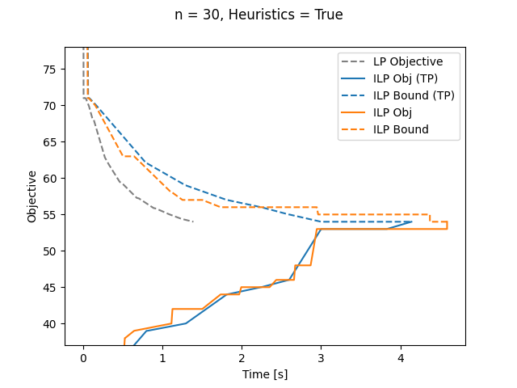
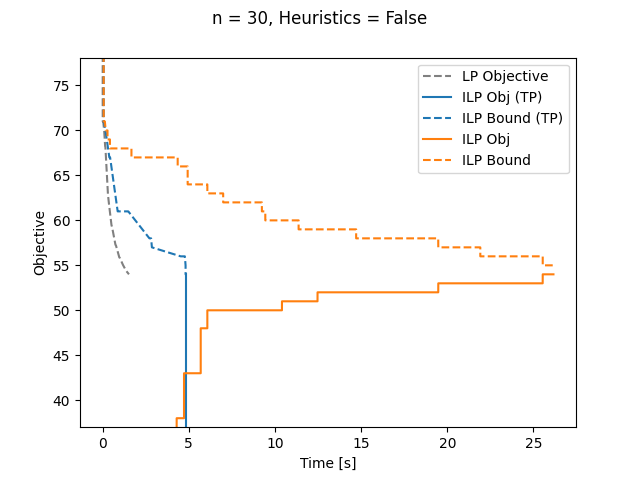
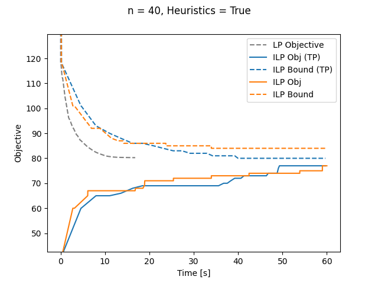
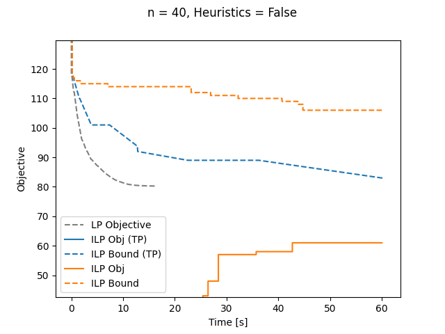

# Using Gurobi for solving the Clique Partitioning Problem

## The clique partitioning problem

Given a complete graph $G=(V, E)$ with positive and negative edge costs $c: E \to \mathbb{R}$, the [clique partitioning problem](https://en.wikipedia.org/wiki/Correlation_clustering) [1] consists in finding a partition $\mathcal{C} = \{C_1,\dots,C_k\}$ of $V$ such that 
$$f(\mathcal{C}) = \sum_{C \in \mathcal{C}} \sum_{ij \subseteq C} c_{ij}$$
is maximum.

### ILP formulation

The clique partitioning problem can be formulated as the following integer linear program:
$$
\max \quad \sum_{ij \subseteq V} x_{ij} \cdot c_{ij} \qquad \qquad \qquad \qquad\\
\text{s.t.} \quad x_{ij} \in \{0, 1\} \qquad \qquad \forall ij \subseteq V \qquad  \\
\qquad \qquad \quad x_{ij} + x_{jk} - x_{ik} \leq 1 \quad \forall ij \subseteq V, k \in V \setminus ij
$$
where $x_{ij} = 1$ indicates that $i$ and $j$ are in the same cluster.

### Two-partition inequalities 

For any two disjoint node subsets $A, B \subseteq V$, $A \cap B = \emptyset$, the two-partition inequality [2] with respect to $A$ and $B$ is defined as 
$$
    \sum_{i \in A, j \in B}  x_{ij} - \sum_{ij \subseteq A} x_{ij} - \sum_{ij \subseteq B} x_{ij} \leq \min\{|A|, |B|\} \enspace .
$$
It is valid for the clique partitioning problem and defines a facet of the clique partitioning polytope if $|A| \neq |B|$.

No exact algorithm for separating two-partition inequalities is known but [3] propose a heuristic that is effective in practice.

##  Solvers

Solvers for the clique partitioning problem using gurobi are implemented in `clique_partitioning_solver.py`.
Implemented are 
- An ILP solver that solves the canonical ILP from above without two-partition inequalities
- An ILP solver that solves the ILP including the two-partition inequalities. This is implemented by adding violated two-partition inequalities found by the separation heuristic from [3] as user cuts within the gurobi callback.
- An LP solver that solve the linear programming relaxation of ILP including the two-partition inequalities. This solver alternates between solving the current LP and adding violated inequalities.

## Results

We run experiments with two instances of the clique partitioning problem with 30 and 40 nodes, respectively whose costs are generated randomly.
We run the two ILP solvers with heuristics and cut generation turned on (Heuristics = True) and off (Heuristics = False).

Depicted below are objective values and bounds of the three solvers described above

|  |  |
|----------------------------|------------------------------|
|  |  |

### Observations

- When heuristics are turned off, the ILP solver with the two-partition inequalities (blue) converges much faster than the ILP solver without the two-partition inequalities (orange). This is expected as the two-partition inequalities can tighten the LP-relaxation significantly.
- When heuristics are turned on, this difference is less pronounced. This is also expected as the heuristics and cut generation allow the model without two-partition inequalities to compute tighter upper bounds.
- The bound computed by the LP solver converges much faster to a good value than the bounds of the ILP solvers. This is surprising as the blue ILP solver also has access to the two-partition inequalities.

### Additional Notes
- The ILP solvers receive all triangle inequalities upfront while the LP solver receives the triangle inequalities in a lazy fashion. 
If the triangle inequalities are added to the ILP solvers also in a lazy fashion, the convergence slows down a lot.
Adding all triangle inequalities to the LP solver upfront, does not significantly slow down the LP solver.
- In the LP solver, constraints that are non-basic for 5 consecutive iterations are removed from the LP in an attempt to keep the model sparse. This improves the convergence speed of the LP solver quite a bit. But even without this the LP solver converges faster than the ILP solvers.
As far as I know, it is not possible to remove constraints or user-cuts from an ILP.

## References

[1] Grötschel, M., Wakabayashi, Y. A cutting plane algorithm for a clustering problem. Mathematical Programming 45, 59–96 (1989). https://doi.org/10.1007/BF01589097

[2] Grötschel, M., Wakabayashi, Y. Facets of the clique partitioning polytope. Mathematical Programming 47, 367–387 (1990). https://doi.org/10.1007/BF01580870

[3] Sørensen, M. A Separation Heuristic for 2-Partition Inequalities for the Clique Partitioning Problem, preprint (2020). https://optimization-online.org/2020/07/7917/